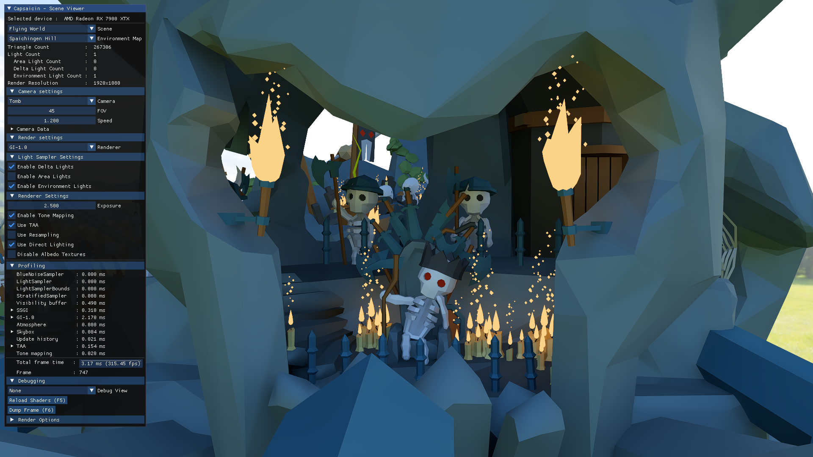

# AMD Capsaicin Framework

Capsaicin is an experimental real-time rendering framework designed for graphics research and development. It is designed to aid in prototype development by providing simple and easy-to-use abstractions and frameworks to improve productivity of real-time research projects.

Features:
- Abstraction of common rendering operations
- Modular framework for easy development and collaboration
- Scene and model loading and animation
- Inbuilt user extensible UI
- Automated debugging and profiling information
- Pluggable and swappable common rendering techniques such as ToneMapping, TAA, AO etc.
- Unbiased reference path tracer



## GI-1.1

We used Capsaicin to implement our GI-1.1 technique for estimating diffuse and specular indirect illumination in real-time.

The technique uses two levels of radiance caching to allow for reduced sampling rate in order to improve performance while making the most of every ray through better sampling.

Please refer to our [GI-1.0 technical report](https://gpuopen.com/download/publications/GPUOpen2022_GI1_0.pdf) and [GI-1.1 paper](https://gpuopen.com/download/publications/SA2023_RealTimeReflection.pdf) for more technical details.

#### Note on light support

GI-1.1 is primarily an indirect lighting solution and as such is expected to be combined with an existing direct lighting technique for integration into a rendering pipeline.

All common light types are supported when evaluating the indirect lighting component (e.g., point lights, spot lights, etc.) using our grid-based light sampler and (optional) reservoir-based resampling.

Furthermore the technique can estimate direct lighting through its probe system for a subset of lights; namely emissive meshes and skylights.

## Prerequisites

- Direct3D12 capable hardware and OS (Windows 10 20H2 or newer)
- [Windows 10 SDK](https://developer.microsoft.com/en-us/windows/downloads/windows-10-sdk/) or newer
- CMake 3.10 or newer (can use Visual Studio, VSCode or any other CMake supported IDE)
- DirectX Raytracing capable GPU and compatible drivers

## Building

Capsaicin uses submodules to include any required dependencies beyond those listed in **Prerequisites**.

When acquiring the code make sure to clone the repo with submodules included:

`git clone --recurse-submodules https://github.com/GPGPU-Desigh-Agents/Capsaicin`

If you have already cloned this repo without submodules, then use:

`git submodule update --init --recursive`

Capsaicin uses the [CMake](https://cmake.org/) build system. See the [Getting Started](./docs/development/getting_started.md) section for more information.

## Resources

- [Documentation](./docs/index.md)
    - [Getting Started](./docs/development/getting_started.md)
    - [Architecture](./docs/development/architecture.md)

## Citation

If Capsaicin is used in any published work, please ensure to cite it using:

```bibtex
@Misc{Capsaicin23,
   author = {Boissé, Guillaume and Oliver, Matthew and Meunier, Sylvain and Dupont de Dinechin, Héloïse and Eto, Kenta},
   title =  {The {AMD Capsaicin Framework}},
   year =   {2023},
   month =  {8},
   url =    {https://github.com/GPGPU-Desigh-Agents/Capsaicin},
}
```

If our techniques are referenced in any published work, please ensure to cite them using:

```bibtex
@inproceedings{10.1145/3610543.3626167,
author = {Eto, Kenta and Meunier, Sylvain and Harada, Takahiro and Boiss\'{e}, Guillaume},
title = {Real-Time Rendering of Glossy Reflections Using Ray Tracing and Two-Level Radiance Caching},
year = {2023},
isbn = {9798400703140},
publisher = {Association for Computing Machinery},
address = {New York, NY, USA},
url = {https://doi.org/10.1145/3610543.3626167},
doi = {10.1145/3610543.3626167},
abstract = {Estimation of glossy reflections remains a challenging topic for real-time renderers. Ray tracing is a robust solution for evaluating the specular lobe of a given BRDF; however, it is computationally expensive and introduces noise that requires filtering. Other solutions, such as light probe systems, offer to approximate the signal with little to no noise and better performance but tend to introduce additional bias in the form of overly blurred visuals. This paper introduces a novel approach to rendering reflections in real time that combines the radiance probes of an existing diffuse global illumination framework with denoised ray-traced reflections calculated at a low sampling rate. We will show how combining these two sources allows producing an efficient and high-quality estimation of glossy reflections that is suitable for real-time applications such as games.},
booktitle = {SIGGRAPH Asia 2023 Technical Communications},
articleno = {4},
numpages = {4},
keywords = {real-time, ray tracing, rendering},
location = {<conf-loc>, <city>Sydney</city>, <state>NSW</state>, <country>Australia</country>, </conf-loc>},
series = {SA '23}
}

@misc{gi10,
  author = {Guillaume Boissé and Sylvain Meunier and Heloise de Dinechin and Pieterjan Bartels and Alexander Veselov and Kenta Eto and Takahiro Harada},
  title = {GI-1.0: A Fast Scalable Two-Level Radiance Caching Scheme for Real-Time Global Illumination},
  year = {2023},
  url = {https://gpuopen.com/download/publications/GPUOpen2022_GI1_0.pdf}
}
```
